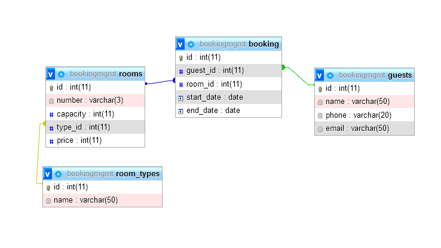

# BookingMgmtApp

BookingMgmtApp is a simple app allowing users to manage accommodation booking in a hotel. It is written in **Java** and uses the **JavaFX** framework and **JDBC**, and depends on a MariaDB MySQL database. Internally, the project aims to implement various enterprise software programming patterns, such as the DAO pattern, used commonly in commercial applications.

---

## Current Features
- View and manage bookings.
- View rooms.

## Project structure

The project is organized into packages, with the following structure:

- `java`: Contains the packages and classes of the project.
    - `model.entities`: Contains the entity classes of the system.
        - `Guest`: Represents the Guest entity.
        - `Room`: Represents the Room entity.
        - `Booking`: Represents the Booking entity.
        - `RoomType`: Represents the RoomType entity.
    - `model.dao`: Contains the interfaces for the DAO classes.
        - `GuestDao`: Interface for the Guest DAO.
        - `RoomDao`: Interface for the Room DAO.
        - `BookingDao`: Interface for the Booking DAO.
        - `RoomTypeDao`: Interface for the RoomType DAO.
        - `DaoFactory`: Class for instantiating DAOs.
    - `model.dao.impl`: Contains the implementations of the DAO interfaces.
        - `GuestDaoJDBC`: Implementation of the Guest DAO using JDBC.
        - `RoomDaoJDBC`: Implementation of the Room DAO using JDBC.
        - `BookingDaoJDBC`: Implementation of the Booking DAO using JDBC.
        - `RoomTypeDaoJDBC`: Implementation of the RoomType DAO using JDBC.
    - `model.service`: Contains the service classes of the system along with helper classes.
        - `BookingService`: Service class for the Booking entity.
        - `ServiceResponse`: Helper class for service responses.
        - `ServiceFactory`: Class for instantiating services.
    - `model.dto`: Contains DTO-style classes that aggregate various related entities.
        - `BookingDetails`: Represents a Booking along with the associated Guest and Room.
        - `RoomDetails`: Represents a Room along with the associated RoomType.
        - `RoomWithBookings`: Represents a Room along with a list of associated Bookings.
        - `BookingSortOption`: Enum for sorting options in the BookingService.
    - `db`: Contains the classes related to the database connection.
        - `DB`: Utility class for configuring the database connection.
        - `DbException`: Custom exception for handling database errors.
        - `DaoFactory`: Class for instantiating DAOs.
    - `controller`: Contains the controller classes for the JavaFX GUI.
        - `MainController`: Controller for the main window.
        - `RoomController`: Controller for the Room view.
        - `BookingController`: Controller for the Booking view.
        - `View`: Enum for the different views in the application.
    - `util`: Contains utility classes.
        - `ScriptRunner`: Utility class for running SQL scripts.
    - `Demo.java`: Demonstration class with examples of using the functionalities.
    - `BookingMgmtApp.java`: Main class for running the JavaFX application.
    - `db.properties`: Configuration file with the database access information.
    - `init.sql`: SQL script for initializing the database.
    - `seed.sql`: SQL script for seeding the database with sample data.
- `resources`: Contains the resources of the project, mainly the FXML files for the GUI.
    - `main-view.fxml`: FXML file for the main window.
    - `rooms.fxml`: FXML file for the Room view.
    - `booking.fxml`: FXML file for the Booking view.
    - `booking-dialog.fxml`: FXML file for the Booking dialog.

Detailed documentation for each individual class and method can be found in the source code in the form of Javadoc comments.

## Running the Application

The application requires a MariaDB MySQL database running at `localhost:3306` to be set up. The database connection details should be configured in the `db.properties` file. The application also requires the MySQL JDBC driver to be included in the classpath.

The application automatically creates the necessary tables in the database by running the `init.sql` script. The `seed.sql` script can be used to populate the database with sample data.

To run the application, follow these steps:  
1. Clone the project repository to your local environment.  
2. Set up a MariaDB MySQL database and configure the connection details in the `db.properties` file.  
3. Import the project into your favorite IDE.  
4. Ensure that the dependencies are correctly configured (e.g., MySQLConnector).  
5. Run the `Demo.java` class to see examples of using the functionalities.  
6. Run the `BookingMgmtApp.java` class to start the JavaFX application.  
7. Use the GUI to interact with the application.  
8. Enjoy managing your hotel bookings!  

## Database Schema

## Future Enhancements

- Add functionality to update every entity.
- Add functionality to manage guests.
- Add functionality to manage rooms.
- Implement more complex business logic (e.g., validation)
- Implement more complex queries and reports.
- Improve the GUI design and user experience.
- Add support for multiple users and authentication.
- Optimize database queries and data retrieval.