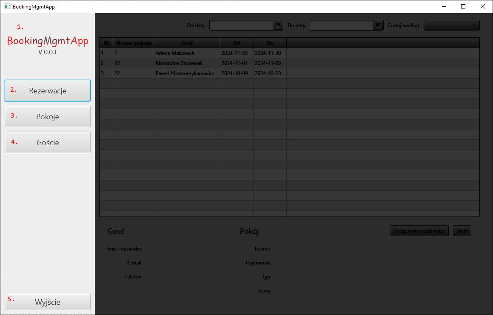
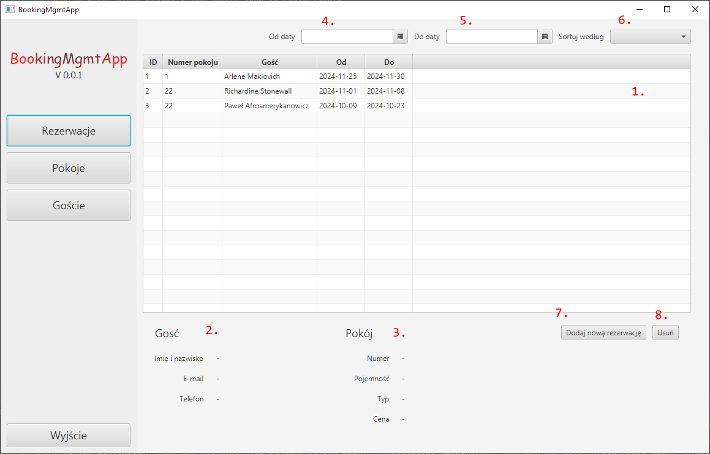
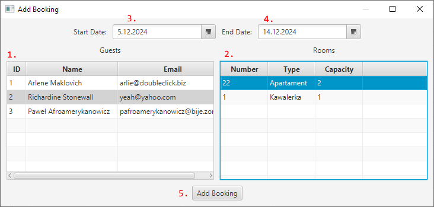
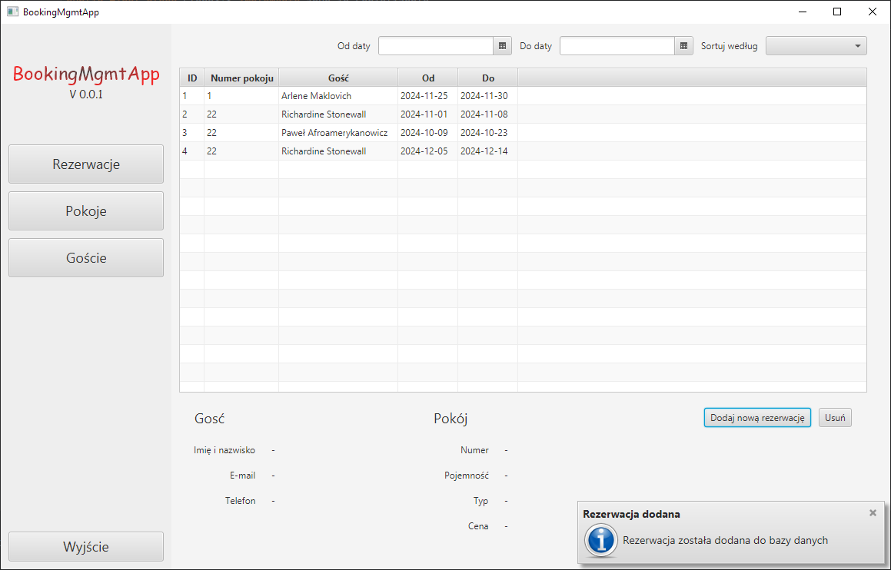
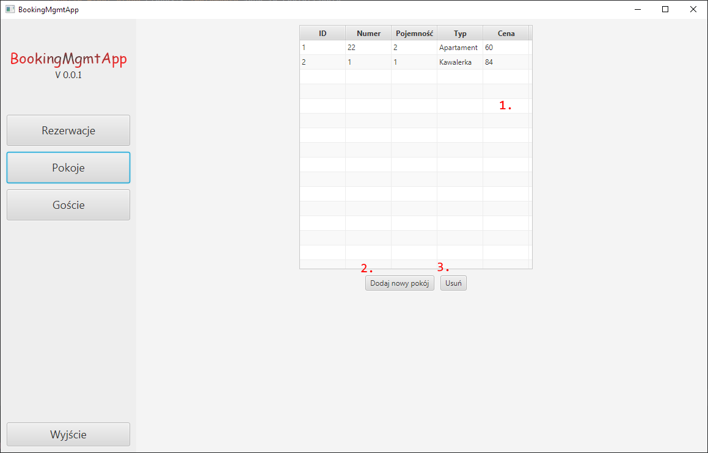

# Interface

This application provides a user interface for managing hotel bookings. The main features include viewing and managing bookings, viewing rooms, and making new bookings.

The interface currently offers a handful of different functional elements. It is also currently written in Polish, but the plan is to internationalize it in the future.

---

## The Sidebar

The sidebar is located on the left side of the application window. It contains buttons for navigating between different views of the application. Its elements include:

- Logo display (**1**): The logo of the application along with the current version number.
- Booking button (**2**): Navigates to the Booking view.
- Rooms button (**3**): Navigates to the Rooms view.
- Guests button (**4**): Currently not implemented.
- Exit button (**5**): Exits the application.

## Booking View

The Booking view displays a list of bookings along with the associated guest and room information. It provides functionalities for viewing, adding, and deleting bookings. Provides a range of sorting and filtering options that dynamically update the table. The Booking view includes:

- A table of bookings (**1**): Displays the list of bookings in a table.
- Guest info display (**2**): Displays the information of the guest associated with the selected booking.
- Room info display (**3**): Displays the information of the room associated with the selected booking.
- "From" date picker (**4**): Selects the start date of range to filter bookings. Automatically updates the table.
- "To" date picker (**5**): Selects the end date of range to filter bookings. Automatically updates the table.
- "Sort by" dropdown (**6**): Sorts the bookings based on the selected criteria. Automatically updates the table.
- "Add Booking" button (**7**): Opens a dialog to add a new booking.
- "Delete Booking" button (**8**): Deletes the selected booking. Shows a confirmation dialog first.

## New Booking Dialog

The New Booking dialog allows the user to add a new booking to the system. It includes the following elements:
 
- Guest table (**1**): Displays the list of guests to choose from.
- Room table (**2**): Displays the list of rooms to choose from. Dynamically updated based on selected dates according to availability.
- "From" date picker (**3**): Selects the start date of the booking.
- "To" date picker (**4**): Selects the end date of the booking.
- "Add Booking" button (**5**): Adds the booking to the system. Greyed out until both a guest and a room are selected.

A confirmation dialog is shown after successfully adding a booking.

## Rooms View

The Rooms view displays a list of rooms along with the associated room type information. It provides functionality for viewing rooms. The Rooms view includes:

- A table of rooms (**1**): Displays the list of rooms in a table.
- Add Room button (**2**): Currently not implemented.
- Delete Room button (**3**): Currently not implemented.
